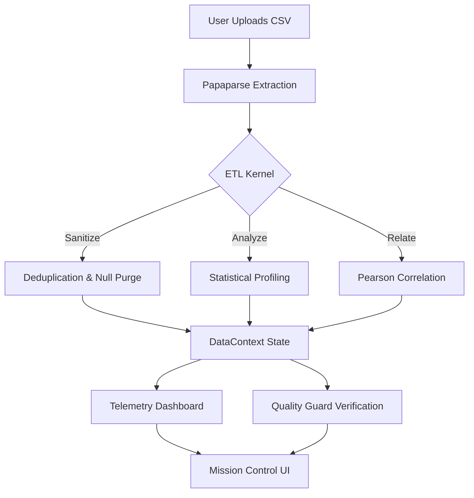

# 🌀 ETL FLOW | Automated Data Engineering Telemetry

[](https://nextjs.org/)
[](https://tailwindcss.com/)
[](https://www.framer.com/motion/)
[](https://opensource.org/licenses/MIT)

**ETL FLOW** is a high-performance, production-grade SaaS dashboard designed for real-time ETL pipeline monitoring, automated data sanitization, and deep relational analytics. Built with a focus on **Glassmorphism aesthetics** and **client-side security**, it enables data engineers to process massive CSV datasets with zero data exfiltration.

---

## 🚀 Key Features

- **⚡ Vectorized ETL Engine**: High-speed, browser-native data extraction and transformation using Papaparse and custom heuristics.
- **📊 Relational Intelligence**: Automated Pearson correlation matrices and statistical profiling (Mean, Median, Min, Max).
- **🛡️ Kernel Guard**: Integrated integrity testing suite to verify cleaning logic against synthetic edge cases.
- **🕒 Automation Scheduler**: Persistent job management system with real-time execution countdowns and telemetry.
- **💎 Premium Glassmorphism UI**: A state-of-the-art interface featuring dynamic background gradients, motion-aware navigation, and responsive layouts.
- **🕵️ Data Quality Pulse**: Real-time completeness heatmaps and anomaly detection logs.

---

## 🛠️ Technology Stack

- **Frontend**: Next.js 15 (App Router), React 19
- **Styling**: Tailwind CSS with custom Glassmorphism tokens
- **Animations**: Framer Motion
- **Charts**: Recharts (High-fidelity telemetry)
- **Data Parsing**: Papaparse (Worker-threaded)
- **Icons**: Lucide React

---

## 📐 System Architecture



---

## 📦 Getting Started

### Prerequisites
- Node.js 18.x or higher
- npm / yarn / pnpm

### Installation

1. **Clone the repository**
   ```bash
   git clone https://github.com/innki/etl-dashboard.git
   cd etl-dashboard
   ```

2. **Install dependencies**
   ```bash
   npm install
   ```

3. **Initialize the development server**
   ```bash
   npm run dev
   ```

4. **Launch the application**
   Open [http://localhost:3000](http://localhost:3000) to access the Mission Control.

---

## 🤝 Contribution Strategy

This project follows an atomic contribution model. Recent milestones:
- **v2.4.0**: Implementation of Pearson Relational Affinity
- **v2.3.0**: 'Kernel Guard' Integrity Test Suite integration
- **v2.2.0**: High-fidelity Mobile Navigation overhaul

---

## 📄 License

Distributed under the MIT License. See `LICENSE` for more information.

---

<p align="center">
  Built with ❤️ for the Data Engineering Community.
</p>
